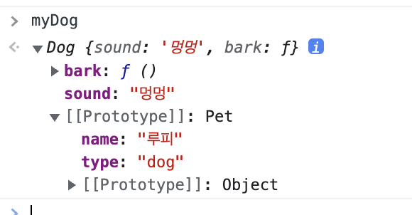

# Object prototypes

JavaScript 는 흔히 **_프로토타입 기반 언어(prototype-based language)_** 라고 한다. 모든 객체들이 메소드와 속성들을 상속 받기 위한 템플릿으로써 **프로토타입 객체(prototype object)** 을 가진다는 의미 이다.
프로토타입 객체도 또 다시 상위 프로토타입 객체로부터 메소드와 속성을 상속 받을 수도 있고 그 상위 프로토타입 객체도 마찬가지 이다. 이를 **프로토타입 체인(prototype chain)** 이라 부른다.

정확하게는 상속되는 속성과 메소드들은 각 객체가 아니라 객체의 생성자의 `prototype`이라는 속성에 정의되어 있습니다.

```javascript
function Pet(type, name) {
  this.type = type;
  this.name = name;
}
function Dog(name, sound) {
  this.sound = sound;
  this.bark = function () {
    console.log(this.sound);
  };
  this.__proto__ = new Pet("dog", name); // Pet 을 상속함.
}

const myDog = new Dog("루피", "멍멍");
```


위의 이미지를 보면 어떤 프로토타입을 상속받았는지 확인 할 수 있다.

위의 예를 보면 `Dog`생성자 함수는 자신의 속성과 메소드로 `bark` 메소드와 `sound`속성을 가지고 있다.또한 `Dog`의 부모 생성자 함수인(`[[Prototype]]` 속성에) `Pet`의 속성으로 `name`, `type` 을 가지고 있는 것을 확인 할 수 있다.

#### 호출 순서

`myDog` 에서 `name`속성값을 호출하게 되면 일단 `myDog` 인스턴스의 속성값으로 존재하는지 확인한다. 그 다음 `[[Prototype]]` 으로 올라가서 해당 속성값이 존재하는지 확인한다. 이것이 **프로토타입 체인**이다.

```javascript
myDog.__proto__.constructor == Pet.constructor; // true
```

`myDog`인스턴스의 `__proto__`속성의 생성자 함수가 부모객체인 `Pet`의 생성자 함수와 일치하는 것을 볼 수 있다.

- `__proto__`는 인스턴스에서 사용되는 실제 객체이다.
- `prototype`은 new로 인스턴스를 만들 때 `__proto__`를 생성하는 데 사용하는 객체다.
