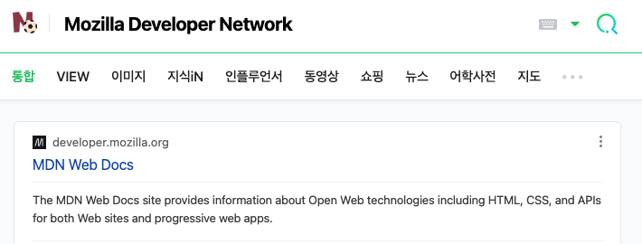

# HTML

HTML 이란?
HTML(HyperText Markup Language)은 웹페이지를 구실하기 위한 **마크업 언어**이다.

> **마크업 언어란?** 태그 등을 이용하여 문서나 데이터의 구조를 명기하는 언어의 한 가지를 말한다.

HTML은 **elements**로 구성되어 있으며, 이들은 적절한 방법으로 나타내고 실행하기 위해 각 컨텐츠의 여러 부분들을 감싸고 마크업 합니다. **tags** 는 웹 상의 다른 페이지로 이동하게 하는 하이퍼링크 내용들을 생성하거나, 단어를 강조하는 등의 역할을 합니다.

## Element 요소 분석

1. 여는 태그 : 열고 닫는 꺽쇠 괄호 + 요소의 이름 Ex) `<P>`
2. 닫는 태그 : 열고 닫는 꺽쇠 괄호 + **슬래시(/)** + 요소의 이름 Ex) `</P>`
3. 내용 : 요소의 내용
4. 요소 : 위 세가지(여는 태그, 내용, 닫는 태그)로 구성

### 속성

속성은 실제 컨텐츠로 표시되길 원하지 않는 추가적인 정보를 포함한다.

1. 요소 이름 과 속성 사이에 공백이 있어야함
2. 속성 이름 뒤에는 등호가 와야함
3. 속성 값의 앞 뒤에 열고 닫는 인용부호(" 또는 ')가 있어야 함

### 요소 중첩

요소 안에 요소가 들어 있을 수 있지만, 안에 들어 있는 요소가 먼저 닫힌 후 밖의 요소가 닫혀야합니다.

```html
<p>
  outer element
  <strong> inner element </strong>
</p>
<!-- 위와 같이 사용해야함. -->
<p>
  outer element
  <strong> inner element
</p>
  </strong>
```

### 빈 요소

어떤 요소들은 내용을 가지지 않습니다. 이것을 빈요소라고합니다.

```html

```

## attribute

HTML 요소들은 특성을 가지고 있습니다. 특성은 요소별로 다른 attribute 를 가지기도 하면 공통적으로 가지고 있는 attribute 를 전역 특성(global attribute)라고 합니다.

- `id`, `class`, `accesskey`, 등등
- `data-*` : 사용자 지정 데이터 특성이라는 특서 ㅇ클래스를 형성함으로써 임의의 데이터를 스크립트로 HTML 과 DOM 사이에서 교환 할 수 있는 방법을 제공합니다.

## HTML 기본 구조

```html
<!DOCTYPE html>
<html>
  <head>
    <meta charset="utf-8" />
    <title>My test page</title>
  </head>
  <body>
    <p>Hello World!</p>
  </body>
</html>
```

- `<!DOCTYPE html>` : doctype. 아주 오래전 HTML 이 막 나왔을때 good HTML로 인정받기 위해 HTML페이지가 따라야 할 일련의 규칙으로의 연결통로로써 작동하는 것을 의미한다. 현재는 그저 올바르게 동작하게 하기 위해 포함되어야할 역사적인 유뮬일 뿐입니다.
- `<html></html>` : 이 요소는 페이지 전체의 컨텐츠를 감싸며 루트 요소이다.
- `<head></head>` : 이 요소는 HTML 페이지에 포함되어 있는 모든 것들의 컨테이너 역할을 합니다.
- `<body></body>` : 사용자에게 보여지길 원하는 모든 컨텐츠를 담고 있습니다.

## Head

HTML 의 head 는 페이지를 열었을때 브라우저에 표시되지 않습니다. title 이나 CSS의 링크, 파비콘, 메타데이터(작성자, 중요한 키워드 등)을 포함합니다.

### title

문서의 제목을 나타냅니다. 브라우저에서 현재 위치한 탭의 이름을 나타냅니다.

### meta

메타데이터는 데이터를 설명하는 데이터이다.

1. charset

```html
<meta charset="UTF-8" />
```

많은 메타 요소는 `name` 과 `content` 속성을 가집니다.

이러한 두가지 메타데이터는 당신의 페이지에서 관리자를 정리하고 머릿말을 요약하는데 유용합니다.

```html
<meta name="author" content="Chris Mills" />
<meta
  name="description"
  content="The MDN Learning Area aims to provide
complete beginners to the Web with all they need to know to get
started with developing web sites and applications."
/>
```

#### 검색결과에 활용

또한 meta 요소는 검색엔진 결과 페이지에서도 사용된다.
다음은 MDN 웹페이지의 meta 테그를 가져온 것이다.

```html
<meta
  name="description"
  content="The Mozilla Developer Network (MDN) provides
information about Open Web technologies including HTML, CSS, and APIs for both
Web sites and HTML5 Apps. It also documents Mozilla products, like Firefox OS."
/>
```

네이버 검색창에 "Mozilla Developer Network"를 검색한 결과에서 meta 및 title 을 요소를 확인한 것이다.


위의 이미지를 보면 MDN 에서 작성한 description 이 검색결과에 나온것을 확인할 수가 있다.

## script

`<script type="text/javascript"></script>`

- type : `<script>` 의 타입은 [IANA Media Types](https://www.iana.org/assignments/media-types/media-types.xhtml) 의 표준 미디어 타입을 준수한다.
- `.mjs` 확장자인 경우 JavaScript 모듈임을 나타낸다.

## link

`<link>` 테그는 해당 문서와 외부 소스(external resource) 사이의 관계를 정의할 때 사용합니다.

- `rel` : 필수 속성으로, 현재 문서와 외부 리소스 사이의 연관 관계를 명시함.
- `href` : 링크될 외부 리소스의 URL을 명시함

> html5 에서는 더이상 `charset`,`target`(링크된 문서를 로드할 위치),`rev`(예약된 연관 관계) 속성을 지원하지 않음.

## CORS

- [CORS 활성화 이미지](https://developer.mozilla.org/ko/docs/Web/HTML/CORS_enabled_image)
- [CORS 설정 특성](https://developer.mozilla.org/ko/docs/Web/HTML/Attributes/crossorigin)
